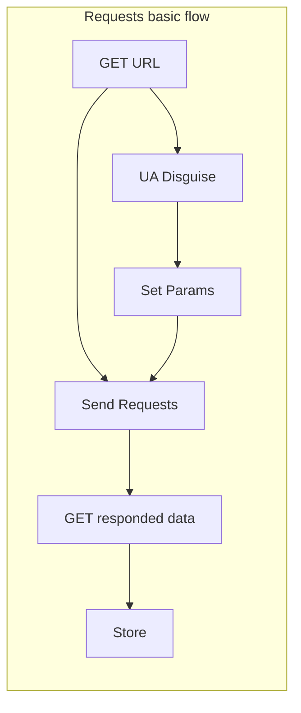
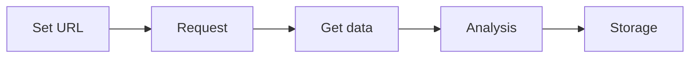

```toc
```

## Introducation
The nature of spider is a programing which *stimulate browse web* and *catch data from the Internet*.

## Legally Rules
- **Dont prevent normal operating of the web**.
- **Dont catch the protected data and information**.
- Check the content which you catched, and insure that dont include sensitive information.
## Spider Basic
### Classification

#### Universal Crawler
- Catch a whole page.

#### Focused Crawler
- Base on universal crawler.
- Catch local data from the whole page.

#### Incremental Crawler
- Monitor website updates, and catch the updates.

### Anti-crawling mechanism
#### Robots protocal
This protocal stipulate the data  enable catched.
Browse `www.taobao.com/robots.txt`, you can find the robots protocal.
### Anti-anti-crawling mechanism

## Web Basic
### Http & Https
```Request Header
User-Agent: Requester's identification.(include OS version, Browser version)
Connection: State of connection when after get request.(KEEP or ALIEVE)
```

```Respond Header
Content-Type: the data type when server respond to the client.
```
(PS:https meas security http. Tttps use data encryption.)

#### Data encryption
- Symmetric key encryption: The Client formulates the encryption method and sends the decryption method to The Server.
- Asymmetric key encryption: The Server formulates the encryption method and tell the client. When Client send the message to Server, it must use the encryption method.
- Certificate-key encryption(HTTPS): 
