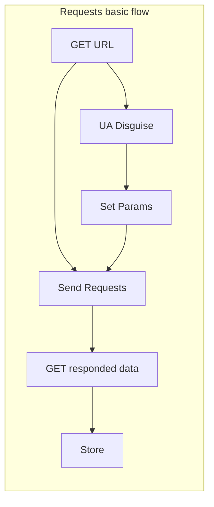
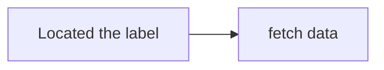

```toc
```

## Model
### requests
Function: Stimulate Browse send requests.
```python
import requests
response = requests.request()
# return a response object
# the method of requests is consistent with HTTP's Request
# there is a normal frame "requests.reqest(method,url,args);".

page_text = response.text
# web page's source
# Struction: 
# response line: protocal version and state number
# state:200(OK) 302(relocation) 304(using browse cache)
# 404(via incorrect) 405(request and method not match)
# 500(server source code fail)
# response head: formal(key:value) which include encoding,etc.
# response body: data
# if what reclocation you need to change the response head.
```


#### HTTP Request
- GET: return a object.
- HEAD: return a header of the object.
(PS: GET and HEAD only get sourse with no action.)
- POST: post the data which will be dealed with. How to deal with depend on Server.
- PUT: Create a new sourse or update the sourse on Server.
(PS:The deffierent between "post" and "put" is url's usage. In post method, the url is used to deal with the data. In contrast, the put method's url is used to change.)
- CONNECT
- OPTIONS: View performance of The Server on Client.
- TRACE: Appear the Request which Server received.
- PATCH: The supplement for PUT, it can update locally.
>幂等性：某个操作执行一次的结果与执行N次的结果相同，称该操作具有幂等性，因此GET，HEAD，DELETE，PUT具有幂等性，而PUT不具备幂等性。

#### UA disguse
```python
header = {
		  'User-Agent':'Mozilla/5.0 (Windows NT 10.0; Win64; x64) AppleWebKit/537.36 (KHTML, like Gecko) Chrome/108.0.0.0 Safari/537.36 Edg/108.0.1462.54'
}
```

### urllib

## Data Analysis
Gets the specified content.
- 解析的局部文本内容都会聚焦于标签之间或标签属性中

### Regular expression

### XPATH(!!!)
### BS4

